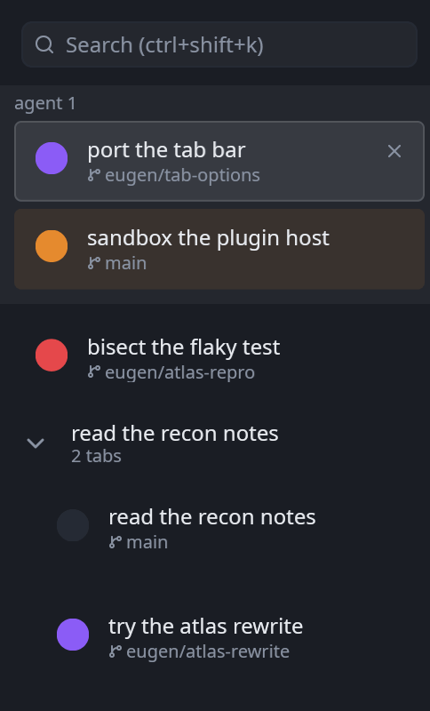
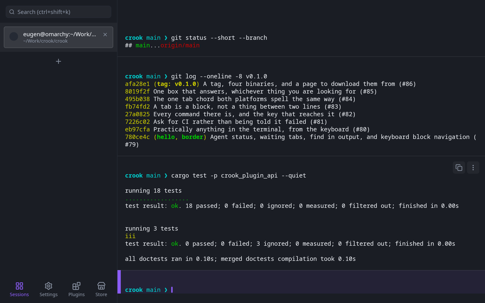
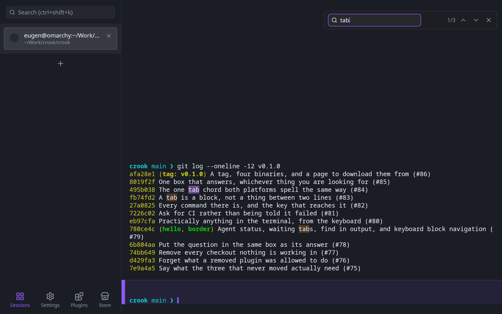
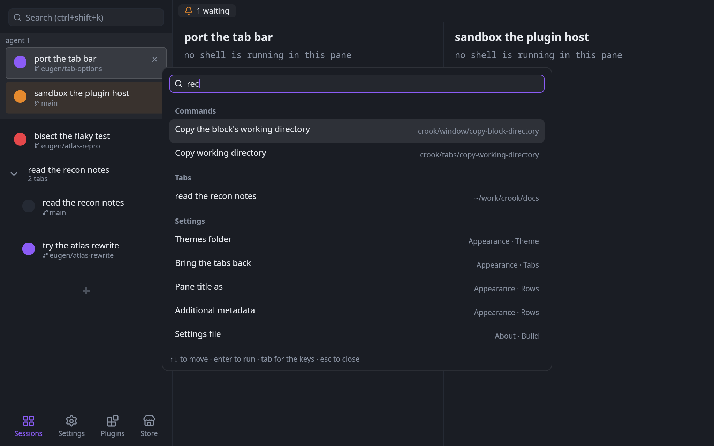
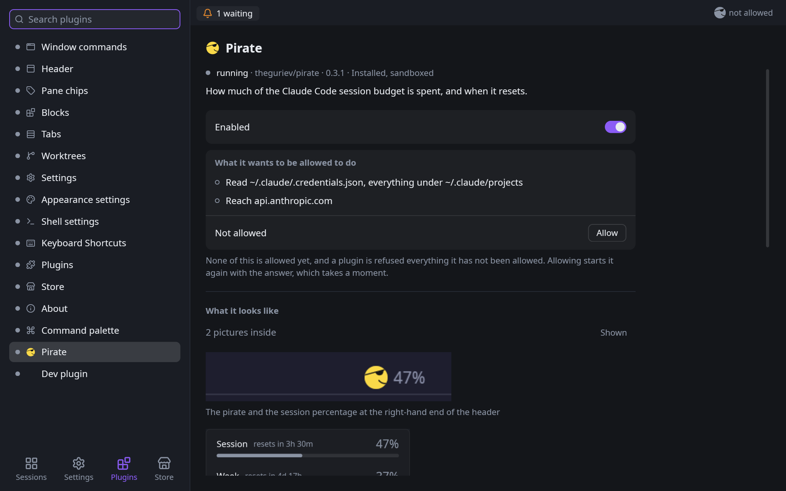

# Crook

A terminal whose unit of work is an agent, not a tab.

Every terminal ever written treats a shell session as the thing you open, arrange and close.
Crook treats an *agent* as that thing. A tab is one agent's workspace: its transcript, its
working directory, its state. The tab strip is therefore a list of what is currently being
worked on, and the header carries whatever says what that work is costing.

Crook copies the architecture of [Warp](https://www.warp.dev) — an Entity/Handle application
core, immutable `View::render`, constraint-based layout, a `Scene` display list handed to a
GPU renderer — while deliberately taking one backend instead of two, and no build scripts at
all. See [`docs/architecture.md`](docs/architecture.md) for what was inherited, what was
dropped, and why.

## What it looks like



The panel down the left edge is the claim above, drawn: one row per agent, a dot saying whether
it is running, waiting on an answer, finished or failed, and under the title the branch that
work is happening on. Two rows that belong together fold into a group with a count — a tab and
the worktree opened from it. The strip is the list of what is being worked on, so reading it is
reading the state of the machine.

<br clear="right">



The output is a transcript of blocks rather than one scrolling screen: a command, everything it
printed, and a boundary. The pointer over a block brings up the two controls in its corner —
copy the whole thing, or open its menu — and the block under the prompt is the one still open.



Find searches the blocks, not the screenful: every finished command and the open one at once,
counted in the bar, the current match in the accent and the rest in amber. It is a search and
not a filter, so the lines between the hits stay where they are.



The palette is one box for everything that has a name: the commands, the tabs that are open
and the rows of the settings, each kind under a heading of its own when there is more than one
kind of answer. A command row prints its name and, when one reaches it, the chord; a tab row
says where it is working and Enter goes there; a settings row says which page and category it
lives on and Enter opens that page with the row on screen. A sigil narrows it to one list —
`>` commands, `@` tabs, `#` settings, `?` what is bound to what — and `tab` walks between them.



Every plugin has a card, and the card is where it is answered. The ones from the box wear one
of Crook's own marks; the ones from a file bring their own face and their own pictures, inside
the module, so the card can show what a plugin looks like before it has been allowed anything —
and what it asks for is a list of sentences with one button beside it, because installing is
not allowing.

These are rendered by Crook itself rather than captured from a window — `--snapshot` draws one
frame of the real view tree to a PNG, which is how a picture of the application is the same on
every machine. The two that print a git log print it up to the `v0.1.0` tag, so that they say
the same thing whenever they are rendered again and the find still counts three:

```sh
./script/run --snapshot docs/images/tabs.png            # then cropped to the panel
./script/run --run 'git status --short --branch' \
             --run 'git log --oneline -8 v0.1.0' \
             --run 'cargo test -p crook_plugin_api --quiet' \
             --hover-block 2 --snapshot docs/images/blocks.png
./script/run --run 'git log --oneline -12 v0.1.0' \
             --find-output tab --snapshot docs/images/find.png
./script/run --action 'crook/palette/open rec' --snapshot docs/images/palette.png
./script/run --dev-plugin ../crook-pirate/target/wasm32-unknown-unknown/release/pirate.wasm \
             --section Plugins --action 'crook/plugins/show theguriev/pirate' \
             --action 'crook/plugins/pictures theguriev/pirate' --snapshot docs/images/plugins.png
```

## Install

```sh
curl -fsSL https://raw.githubusercontent.com/theguriev/crook/main/script/install | sh
```

macOS on both architectures, and Linux on x86_64 with glibc 2.31 or newer: Debian 11, Ubuntu
20.04, RHEL 9 and anything since. It reads the latest release, checks the archive against the
`SHA256SUMS` published beside it, and puts the binary in `~/.local/bin`, or somewhere else with
`--to`. Windows is a `.zip` on the [releases page](https://github.com/theguriev/crook/releases).

The Linux binary is built in a Debian 11 container so that it starts on all of those, and
`script/glibc-floor` stops a release whose binary would need a newer glibc before it is
published. v0.1.13 was built on Ubuntu 24.04 instead: it needs glibc 2.39, and on anything older
it does not start, with ``version `GLIBC_2.39' not found``.

### Linux, in the launcher

```sh
curl -fsSL https://raw.githubusercontent.com/theguriev/crook/main/script/install | sh -s -- --desktop
```

`--desktop` also installs Crook's desktop entry, its icons and its AppStream record under
`~/.local/share`, which is what puts it in the application menu and lets `xdg-terminal-exec` —
what a launcher's *Open in terminal* and a `Terminal=true` entry ask for — start it. The Linux
archive carries all three under `share/`, laid out the way a package installs them. Nothing that
is not Crook's is written: which terminal your desktop opens is yours to say, so
`xdg-terminals.list` and `mimeapps.list` are left alone and the installer prints the one command
that puts Crook first.

A launcher starts Crook the way it starts any terminal, with the flags the entry advertises:

```sh
crook -e htop -d 10                     # a window whose one pane runs htop, and closes with it
crook --working-directory ~/src/crook   # a window whose shells start there; --cwd is the same
crook --title notes --app-id notes      # its name, and the app_id / WM_CLASS a window rule matches
```

Everything after `-e` is the command, as in xterm, and `crook -- htop -d 10` says the same. It is
typed into the pane's shell as an `exec`, so it runs on the `PATH` your profile built and, when it
exits, the pane closes the way it does when a shell exits. `-e` is not available on Windows, whose
shells have no `exec`. The line it types has to fit what a terminal keeps of a line typed before its
shell is reading, which is 4095 bytes on Linux and about a thousand on macOS; a longer command is
refused rather than cut short.

**A window opened with `-e` or `--working-directory` is a launcher's.** It is a quick terminal
beside your work rather than the work: it opens fresh instead of as the last window, and nothing it
does is written to the session file, so closing it leaves the agent tabs your next ordinary launch
comes back to exactly as they were. `--title` and `--app-id` alone open an ordinary window.

That covers every window a launcher opens with a directory, including one that always names a
directory. Omarchy's terminal key is one: it runs `xdg-terminal-exec --dir=…` with the focused
terminal's directory, or your home when there is none. So once Crook is xdg-terminal-exec's first
choice, the windows that key opens start fresh and never save the session. To get your tabs back,
open Crook from the application menu or run a plain `crook`.

### macOS, from the browser

`crook-v<version>-macos.dmg` on the [releases page](https://github.com/theguriev/crook/releases)
holds `Crook.app` — one universal build for Apple Silicon and Intel both. It is signed with a
Developer ID, notarized, and the ticket is stapled to the app before the image is built around
it, so it opens on a double click with no dialog and no network. Drag it to Applications.

That is the difference notarization makes, and it is worth knowing what it fixes. A Mac
quarantines anything a *browser* downloads, and on an unnotarized build the first launch is
refused outright — *"Apple could not verify 'crook' is free of malware"*, offering only **Move to
Trash** and **Done**. Releases before v0.1.1 were unnotarized and do that. If you are looking at
that dialog now, press **Done** rather than *Move to Trash*, and clear the attribute yourself:

```sh
xattr -dr com.apple.quarantine crook && ./crook
```

On macOS 15 and later that command, or **System Settings → Privacy & Security → Open Anyway**, is
the whole of the way past it: the old right-click-and-Open shortcut was removed.

The `.tar.gz` archives hold the bare binary and are what `script/install` fetches. Nothing `curl`
downloads is quarantined, which is why that path never needed the dialog in the first place.

To build it yourself instead, see [Prerequisites](#prerequisites) and [Build and run](#build-and-run).

### Updating

```sh
crook --check-update      # is there a newer release? one request, and only when you ask
crook --update            # fetch it, check it against SHA256SUMS, and replace this binary
crook --update-plugins    # the same for every installed plugin the registry is ahead of
crook --update-plugin theguriev/chips
```

`--update` installs the archive for this platform the way `script/install` does — verified
against the published sums, unpacked, and renamed into place within the binary's own directory —
so a Crook that is running keeps the file it started from until it is restarted. Where the binary
is not Crook's to replace it says so and stops: a notarized `Crook.app` is replaced whole from
the disk image, a binary a package manager installed is that package manager's, and a build in
`target/` is another build.

Both also live in the window. **Settings → About** has an **Updates** row: *Check for updates*
asks, the answer is the line under it, and *Update* appears beside it when this copy is one Crook
may replace — with the reason in its place when it is not. While a check has found a newer
release the **Settings** button in the sidebar carries a dot, which is the whole of the notice.
A plugin is the same story on its own card: the Plugins page says when the registry is ahead of
it and offers **Update**, and the list has **Update all**.

**Nothing here is asked of the network until you ask for it.** There is no check at launch, no
timer and no background poll, which is the same rule the store is written under: the request
goes out when you run one of these, or press one of those buttons, and carries no version, no
machine id and nothing else about this machine.

## When something goes wrong

Every window Crook opens writes a log file, and a panic writes a crash report, into one folder
on this machine:

| platform | folder |
| --- | --- |
| Linux | `~/.local/state/crook` — `$XDG_STATE_HOME/crook` when that is set |
| macOS | `~/Library/Logs/Crook` |
| Windows | `%LOCALAPPDATA%\crook` |

`logs/` holds `crook-<channel>-<when>.log`, `<when>` being the launch in UTC: the lines the
terminal gets, filtered the same way (`RUST_LOG` still decides), written whether or not a
terminal is attached. `crashes/` holds `crook-<channel>-<when>.txt`, `<when>` being the panic:
the version and platform, where it panicked and with what message, a backtrace, the GPU it was
drawing with, and the last 200 lines of the log. A shipped build's backtrace names functions but
not files and lines on Linux and macOS, and names nothing on Windows, whose names are in a
`crook.pdb` the download does not carry — there the report's `Where` line is the place to start.
The newest five of each are kept, and a log another Crook window is still writing is never
removed. **Settings → About → Logs and crash reports** names the folder and opens it, and after
a crash the next window says so in one line under the header: *Show* opens the folder,
*Dismiss* puts the line away, and neither brings back a report that line was about.

**Nothing in that folder leaves this machine.** Crook never sends, uploads or reads any of it
back to anyone. To report a problem, [open an issue](https://github.com/theguriev/crook/issues)
and attach the crash report, or paste the log lines from around the time it went wrong — having
read them first, since a log can name folders and files of yours.

What it cannot catch is a native crash: a segfault in a GPU driver, an access violation, an
abort inside a system library ends the process without running any of Crook's code, so it
leaves no report. The log file is still there up to its last line, and the system's own crash
reporter — `coredumpctl`, Console.app, the Event Viewer — has the rest.

## v1 scope

Nineteen features, and the page that configures them:

- **Tabs.** Open, close, switch, reorder. One agent session per tab, and the tab is named
  the way a person would answer "what is that one?": what you called it, else what the agent
  in it calls its work, else what it is running right now — `cargo test` while the tests run —
  else the directory it sits in. A number is what is left when a pane has no name, no program
  and nowhere to be, which is nowhere anybody works.
  They live in a panel down the left edge, and a **View options** menu — the panel's own
  secondary click, on the empty space the list leaves — says what a row of them shows: which
  fact it leads with, what its second line says, which chips it carries, whether hovering it
  opens a card, and the tab's number, which is the one `cmd-4` means once the tabs are named.
  One more row is the Appearance page's alone: **Status marks**, which turns the dot into a
  glyph per state in the same colour — a play mark, a bell, a crossed ring, a hollow one — for
  an eye the colour says nothing to, or a screenshot in greyscale.
  Under that space is a `+`, which is where Warp's browser puts the one that opens another tab.
  Above the list is a **search box**, Telegram's way round: it
  filters the rows by what a tab is running, where it is working, the branch it is on and its
  status word — `waiting` is the amber rows, and `running`, `failed` and `idle` are the dot's —
  and filters nothing else — the active tab stays active and a filtered-out tab goes on
  printing.
  `cmd-k` (`ctrl-shift-k` off macOS) puts the keyboard in it from anywhere in the window,
  Enter opens the top match, and Escape gives the keyboard back to the shell.
  `cmd-b` (`ctrl-shift-b`) hides the whole panel for wide output or a small screen and brings
  it back on the next press — the search chord brings it back too, since a box nobody can see
  is no use — and a hidden panel stays hidden across launches.

  Tabs that belong together are folded into a **group**: a heading with a chevron, a count and
  a close button, and its tabs indented under it. A worktree opened from a tab makes one out of
  the two of them, which is what says the two checkouts are one piece of work. Drag a row into a
  group to add it, past the group's edge to take it out, and a heading to move the whole block.
  The row leaves the list and follows the pointer, the list reorders itself under it as it goes
  and shows the slot it will drop into, and a group whose last tab leaves it goes away by
  itself. A group is not a split screen — the tabs in it are still one at a time, and splitting
  a tab is still `cmd-d` (`ctrl-shift-d` off macOS), asked for on purpose.

  **The window comes back the way it was closed**: the tabs with their names, pins, colours
  and groups, the splits, the directory each shell was in — and, for a pane that was running a
  coding agent, that agent's name. Every Crook update is a restart and a restart ends every
  process in the window, so a pane that had Claude Code in it comes back as a shell in the same
  directory with `claude --continue` waiting in its command line, **unsent**: nothing runs
  until you press Enter. Codex is offered `codex resume --last` and Gemini CLI `gemini --resume
  latest`, each the most recent conversation in that directory, and Copilot its `copilot
  --resume` picker, since its most recent is the repository's rather than the worktree's. Two
  panes of one agent in one directory are offered its picker instead (`claude --resume`,
  `codex resume`), because the directory names one conversation and they had two; Gemini CLI
  has no picker on its command line, so two of its panes in one directory are offered nothing.
  Any command that runs in a pane first, even a `cd`, ends the offer there; clearing the line,
  with ctrl-c or otherwise, does not, and the next restart offers it again. **Resume
  every agent** in the palette (`resume-agents`) sends every line a restore typed that you
  have not touched, in one press. What is remembered is the program's name and nothing after
  it, so a prompt typed on the command line never reaches the file, and it needs the shell
  integration, which is what says what a pane is running. A line of your own goes in
  `settings.json` under `resume_lines`, keyed by program — `{"claude": "claude --continue
  --model opus"}` — and an empty one offers nothing. OpenCode and aider have no line until you
  give them one: OpenCode's `--continue` reaches across a repository's worktrees, and aider's
  `--restore-chat-history` is left for you to choose. No output comes back, and no process
  does.
  **Closing asks first when it would end something still working.** The window's close — the
  desktop's close button, `alt-f4`, the palette's Close the window — a row's ×, a group's and
  `cmd-w` (`ctrl-shift-w`) on a pane all end whatever runs in the panes they take, so while an
  agent in one of them is running or waiting on you, or its shell is running a command, a card
  says how many, names up to three, and offers **End them and quit** (or **End them and close**)
  beside **Cancel**. Cancel is the default: Enter and Escape both press it, and so does a click
  anywhere off the card. Tab or the arrow keys move to the other button, and Enter or Space then
  presses whichever is filled — once the keyboard has been still for a second, so a Tab and a
  Space typed on after a stray close cannot end anything. While the card is up the pane under it
  hears no keys at all, so a `ctrl-c` meant for the card cannot interrupt the agent it is asking
  about. A window close that asks restores a minimised window and, if the window is not the one
  being typed in, asks the desktop for attention rather than taking the keyboard: a flashing
  taskbar button, a bouncing dock icon, an urgent window, or on Wayland an activation request
  the compositor may answer by focusing it. A close with nothing working in it goes at once, as
  it always did.
  **Ask before ending working agents**, on the Appearance page, turns the question off, and
  **End all agents and quit** in the palette quits without it once. Nothing can ask when the
  system ends Crook itself — a `SIGTERM`, a logout — and on macOS the Quit menu item and `cmd-q`
  are that case too: AppKit ends the application before the window hears about either.
- **The window's own title bar.** There is no strip of system chrome above Crook. The window is
  opened with the application's frame, so the header *is* the title bar: dragging its empty
  space moves the window and a double click maximises it. On macOS that surface carries
  AppKit's traffic lights — the bar is made transparent and the content view reaches the top of
  the window, so the buttons stay exactly where every Mac application has them, and the header
  reserves the 70px they occupy and takes it back in fullscreen, where macOS moves them away.
  Crook draws no caption buttons of its own anywhere: on Windows and Linux the window has no
  frame at all, the header runs to both corners, and minimising, maximising and closing are the
  desktop's own shortcuts and the window plugin's commands. Crook still finds its own resize
  edges there. **Linux has been run and Windows has not**: the frameless window comes up under
  Hyprland with a shell drawing in it, and what that first run found was a window with no
  `app_id` — nothing a window rule could match — which is fixed. See
  [`docs/architecture.md`](docs/architecture.md) §3 for what is still unrun and what was checked
  instead of running it.
- **Plugins, in two tiers, and the second one is not in the binary.** Everything Crook itself
  does is a plugin on the registries a stranger's plugin uses — the header, the window's own
  commands, the command palette, every settings page — which is the only way to know
  the API is enough. Beside that native tier is a **sandboxed** one: a `.wasm` module in the
  plugins directory, run in an interpreter with no imports but a handful, with no filesystem,
  no network and no clock of its own. It *describes* what it wants drawn — text, a badge, a
  meter, a hairline, something pressable, a panel hung under it, one of Crook's own icons by
  name — and the host paints it, so a plugin names no colour and no pixel and comes out right
  in a theme written years after it. Anything it wants from the machine it has to **ask** for,
  and every request is checked against what a person granted on the Plugins page and kept in
  `settings.json`. A request outside that grant is refused rather than failed, and the refusal
  carries the sentence the permission dialog says, so a plugin can tell you what to allow
  instead of that something went wrong.

  **The Claude Code usage chip is the worked example**, and it is the proof, because it used to
  be one of the features on this list and is now a file. It lives at
  [github.com/theguriev/crook-pirate](https://github.com/theguriev/crook-pirate) and ships as
  one 204KB `plugin.wasm`. `crook --install-plugin <path>` checks the module, reads its
  manifest and puts it where Crook looks —
  `<data>/crook/plugins/theguriev.pirate/0.3.0/plugin.wasm`, the version in the path so that an
  upgrade writes somewhere new rather than over the bytes a running interpreter is reading.
  `crook --plugins` says what is installed and which file each one runs from — as a JSON array
  with `--json`, for a script or an agent — and
  `crook --uninstall-plugin theguriev/pirate` takes it and its permissions back off. It draws
  Crook's own pirate — the artwork is the host's, asked for by icon name, and the plugin
  animates the bite itself by naming a different frame — and it says how much of the session's
  token budget is spent and when it resets. To do that it asks to read one file,
  `~/.claude/.credentials.json`, and to reach one host, `api.anthropic.com`. It can reach
  nothing else, and until somebody says yes it reaches neither.

  **A plugin can also be asked the same question once per row.** The mark at the head of every
  tab in the panel is a slot, and the small badge on its corner is another one, so a plugin
  can replace what a tab is drawn as or add one more thing to it. A contribution to those is
  handed the row it is being drawn on, with everything a person did not allow it to see left
  out — and a plugin allowed *nothing* still gets one number per row, the same number for one
  tab every day and a different one for the tab beside it. That is enough to give every tab a
  picture of its own, and it is what
  [github.com/theguriev/crook-emoji](https://github.com/theguriev/crook-emoji) does: an emoji
  where the status dot was, asking for no permission at all. Beside it,
  [github.com/theguriev/crook-worktree](https://github.com/theguriev/crook-worktree) puts a
  branch mark on the corner of every tab whose directory is a git worktree, which it can only
  do because somebody allowed it to see which project each tab is in.

  **And there is a place to get one from.** The **Store** at the foot of the sidebar is the
  registry's list — [github.com/theguriev/crook-plugins](https://github.com/theguriev/crook-plugins),
  which builds every plugin from source and publishes one static `index.json`. Nothing is
  fetched until you press *Look for plugins*: no account, no machine id, no list of what you
  have — the request says `crook` and not even which version — and a machine that is offline
  shows the last list it read with its age under it.
  Pressing **Install** downloads one file, checks it hashes to what the list said, checks the
  module's own manifest against what the list promised — an index is a mirror and never the
  authority — and then *runs it*, in the window that is already open. Every press is one
  request: **Update**, **Update all** (one module at a time), and **Fetch pictures** — a
  plugin's screenshots are inside its module, so seeing them before installing is fetching
  the same file Install would, which the card says beside the button, and Install afterwards
  needs no second download. A version the registry
  **withdraws** stops running at the next launch, with the sentence whoever withdrew it wrote on
  its card; that is read off the list already on this machine, so it holds offline, and a list
  that cannot be read withdraws nothing. Installing is still not
  allowing: a plugin that has just arrived may do nothing at all until its card in **Plugins**
  is answered, and **Remove** takes it and its permissions back off.

  **Writing one is a flag and a template.** `crook --dev-plugin <path>` runs the module you are
  working on straight out of `target/`, and runs it again every time you build it: no install,
  no copy, and nothing left on the machine when the window closes. A build that does not compile
  is a line in the log and the version before it still running. What to point it at on the first
  afternoon is
  [github.com/theguriev/crook-plugin-template](https://github.com/theguriev/crook-plugin-template)
  — five exports, a manifest that asks for nothing, and one shape to change.

  **The second worked example is the chips**, and it is the one that proves a plugin may
  *act*. It lives at [github.com/theguriev/crook-chips](https://github.com/theguriev/crook-chips)
  and draws the row under the line you are typing: where the pane is, which branch it is on,
  how much has changed, and what one chord would do. Pressing the first opens a directory
  picker; pressing the second opens a branch picker; choosing a row in either **types the
  command into your shell** — `cd …` or `git switch …`, quoted by the host, and only ever
  those two, because those two strings are what it asked to be allowed. The third chip runs
  the command it names, and its secondary click offers to change the chord — which opens
  Crook's own Keyboard Shortcuts page with that row recording, not a recorder of the plugin's. The field, the filtering, the arrow keys, Enter and
  Escape all belong to Crook: the plugin says what can be chosen and is told which row a
  person chose, so a chip with a search box in it is never handed a keystroke.
- **An agent that says what it is doing.** The dot on a tab's row is written by the program
  in the pane, over the one channel it already has: `crook --agent running`, `needs-input`,
  `failed` or `idle`, with `--title` for what it calls its work, writes one escape sequence to
  its own terminal and exits. `needs-input --message "run rm -rf build?"` says what it is
  waiting for, and the row prints that under the title until the agent gets on with it — so
  you know whether to come now or later without switching to the tab; `--message -` reads it
  from stdin, a hook's JSON `message` or the whole line. No socket and no pane id — the
  terminal it has *is* the pane — so it works from a hook, over `ssh` and inside a container,
  and every other terminal drops the sequence unread. A hook with no terminal of its own —
  every hook Claude Code runs — writes to the terminal of the program that ran it: the same
  pane. Claude Code says all of it by itself — running when a prompt is sent and around every
  tool, needing input whenever it stops to ask, with the notification's own text as the
  message, idle when it is done — once Crook's plugin is installed:
  `claude plugin marketplace add theguriev/crook`, then `claude plugin install crook@crook`,
  with a Crook newer than 0.1.13. That is Claude Code writing its own settings, not anyone
  merging JSON; the plugin's hooks call `$CROOK_BIN`, do nothing in any other terminal, and
  exit 0 even when a report fails, so a Crook that cannot be reached is a line in Claude
  Code's debug log rather than a notice on every prompt; it carries the skill below too.
  `crook --agent-hooks claude` prints those two commands, then the same hooks as JSON for a
  person who would rather merge them into `~/.claude/settings.json` by hand.
  `codex`, `gemini` and `copilot` print the same for Codex CLI, Gemini CLI and GitHub
  Copilot CLI in each one's own hooks file, `opencode` prints the plugin OpenCode loads
  instead, and `aider`, which has no hooks, gets a sentence saying what to do instead.
  `--pull-request <url>` beside any status says which pull request the work is, and the row
  carries it as a chip that opens it — https only, capped, on a sequence of its own,
  `OSC 6342` — until the pane moves to another branch (a rebase is not a move); the Claude
  Code and Codex hooks send the address a `gh pr create` printed, with no second hook and no
  `jq`. Crook asks no forge to find it. The chip reads `PR #123` for github.com and names the
  host anywhere else, and the hover card prints the whole address, since any program in the
  pane can write the sequence.
  **Check pull request** on the row's menu is the one place Crook asks the network about your
  work: it runs your own `gh pr view <url> --json state,statusCheckRollup` once, on that
  press, under a deadline — no token of Crook's, no timer, no poll — and the hover card says
  open, merged or closed and how the checks stand until you press again, or that `gh` could
  not be found, is not signed in, or could not reach GitHub. `gh` is looked for on Crook's
  `PATH` and then where Homebrew, MacPorts, gh's own package and `~/.local/bin` put it, so a
  Crook opened from the Dock finds it too.
  `crook --skill` prints the skill file that teaches an agent the rest — how to tell it is in
  a pane, what the four words do, where the worktrees and the plugins are — to save as
  `~/.claude/skills/crook/SKILL.md`.
  **And the window answers.** `crook pane list` asks the window a pane is in what it has open
  and prints a row per pane: its number (the one in `CROOK_PANE_ID`, the focused one marked
  `*`), what its agent said, its title, group, branch and directory, and under it what a
  waiting agent is waiting for; `--json` prints the window's own array, for a script or
  another agent. It goes over a Unix socket in a directory only you can enter, named in every
  pane's `CROOK_SOCKET` — never a network port — and it only reads. Outside a pane it asks
  the one Crook that is running and refuses to guess among several. Not on Windows yet.
  **And an agent can fan its work out where you can see it.** From inside a pane,
  `crook tab new --worktree fix-x --in-my-group -- claude "fix the flaky test"` opens a tab
  beside it — in a new worktree on `fix-x` from the pane's `HEAD`, folded into the pane's group —
  without taking your keyboard, and runs the command at the new shell's first prompt, every word
  as itself; it prints the new pane's number for `crook pane list` to watch. A pane is known by
  the secret in its own `CROOK_TOKEN`, so a script that is not in a pane can list but cannot
  open anything; eight tabs may be open on behalf of one pane you opened, a worker's own workers
  counted in, and the new row's card says which pane opened it. `sh`, `bash`, `zsh` and `fish`
  only.
  **And wait for it, and read what it did.** `crook pane wait 7 --until needs-input --timeout
  600` blocks until pane 7's agent stops for a person — or is `idle`, or its command has
  `finished`, or the pane has `exited`, even before you asked — and prints where it got to,
  failing when the time runs out first; `crook pane blocks 7 --last 1` prints its newest
  finished command with what it printed, its exit status, how long it took and where, the end of
  a long output kept and marked cut; `crook events --follow` is a line of JSON for every status,
  every command finished (named, with its exit status) or seen running, and every tab opened and
  closed, and a reader that falls behind is told how many it missed rather than held for. A
  pane may watch itself and the tabs it opened, and nothing a person opened: that needs a grant
  Crook cannot ask for yet. A command still running has not finished, and an interactive agent
  is one live screen with no finished command to read: `pane blocks` says so rather than
  printing nothing, and a worker whose answer is meant to be read runs headless, `claude -p`.
  Crook also reads the notifications other terminals show — OSC 9, 777 and 99 — as the pane
  asking for a look, with the notification's text on the row and the status left as it was, so
  an agent on a remote box with its notification channel set to `iterm2`, `ghostty` or `kitty`
  lights its row with no Crook binary there.
  A status the agent never took back goes when the shell's own marks say the command ended,
  and a failure stays on the row until the next command starts. Looking at a tab clears the
  *attention* it asked for and nothing else: an agent waiting for an approval is still waiting
  after you glance at it. Looking means the pane has the keyboard *and* the window is the one
  in front: in a window behind another application even the pane with the keyboard is nobody's,
  so the agent in the only pane you have is waiting like any other when it stops to ask, and
  coming back to the window is the glance. A row that is waiting for you is washed amber, the
  header counts them in a chip that goes to the next one when pressed, and `cmd-j`
  (`ctrl-shift-j` off macOS) does the same from the keyboard, round the list in the panel's
  order. The window is named after the tab it shows, with that count in front —
  `(1 waiting) bisect the flaky test — Crook` — so a switcher or a taskbar tells three Crooks
  apart and says which one stopped for you. When one more starts waiting while the window is
  behind something else, Crook asks the desktop to point at it: the dock icon bounces once on
  macOS, the urgency hint goes up on X11, an activation request goes to a Wayland compositor
  that takes them and the taskbar button flashes on Windows — a request for a look, not a
  notification, and it is taken back when the window comes to the front. On Linux, and on macOS
  from Crook.app, a pane whose row turns amber while the window is behind something else — its
  agent stops to ask or says it is done, or a program rings the bell — also posts a desktop
  notification, titled `Crook — <tab>` with the agent's question under it, at most once every
  thirty seconds for a pane nobody has come back to, through `notify-send` on the session bus or
  a Mac's Notification Center (which asks you once, the first time a pane waits for you or
  Crook has something to post) and nowhere else; the **Notifications** settings page turns it
  off, the question included, and turns on the same for an agent that failed or a command that
  ran ten seconds or more. A click on one does not bring the pane forward. Windows posts none
  yet, and nor does a Mac binary outside Crook.app, since macOS delivers only to an app.
  Crook.app also puts the waiting count on its dock icon as a badge, under the same permission
  as the notifications and its Badges switch, so with notifications off there may be none; a Mac
  binary outside Crook.app is given the count too, and whether the dock shows it is unverified.
  A program that turns on focus reporting (`?1004`) is told `CSI I` and `CSI O` as the keyboard
  reaches its pane and leaves it, the window's own focus included, so an agent can tell whether
  anybody is watching.
- **A shell in every pane.** A real pseudo-terminal and a real xterm-compatible emulator:
  colour, bold and italic faces, underline and strikeout, the alternate screen, ten thousand
  lines of scrollback, `SIGWINCH` on resize, and titles and working directories the shell
  reports with OSC 0, 2 and 7 — which is what makes a tab rename itself and its git chips
  follow a `cd`. A tab splits into panes with `cmd-d` and `cmd-shift-d` (`ctrl-shift-d` and
  `ctrl-shift-e` off macOS), `cmd-shift-m` (`ctrl-shift-m`) gives the focused pane the whole
  tab and the split back on the next press, tmux's zoom, and a shell that exits closes its
  pane, its tab, and with the last tab the window. With shell integration the scrollback
  moves into the blocks: each finished command owns its rows, so ten thousand *commands*
  survive a `clear`, a resize, and the emulator's own history evicting anything.
- **Output as a list of commands.** A pane is not a grid with decorations drawn over it: each
  command is a block holding its prompt, the line that was run and everything it printed, with
  a hairline between one and the next, a red wash on one that failed and an accent stripe on
  one that is still running. Hovering a block reveals a control that copies exactly that
  command and its output — no neighbour's text, no trailing blank rows, no over-selection —
  which is the thing scrollback cannot do. The list virtualises: a frame costs a screenful,
  not a session. **This needs shell integration**, which Crook installs into zsh, bash and
  fish by itself; see below for what a shell without it looks like.
  [`docs/blocks.md`](docs/blocks.md) is the map of the whole surface.
- **Output you can select and copy, across every command in it.** Drag across a pane's output
  to select it, double click for a word, triple click for a line, alt-drag for a column; the
  drag keeps going when the pointer leaves the pane, a drag past the top or bottom edge scrolls
  the list under the pointer, and the selection stays on its own text while the shell prints
  more underneath and while the list scrolls over it. **A selection is a block, a row of that
  block and a column** rather than a cell of the grid, so it spans the commands that have
  finished as well as the one still running: a drag from one block into the next copies the
  ends partially and the blocks between them whole, joined with one newline and none of the
  padding between them. A line the terminal folded comes back as the one line it is, trailing
  blanks stay behind, and a double-width character copies as one character.
  `cmd-c` — `ctrl-c` or `ctrl-shift-c` off macOS — copies it and lets it go, so the next
  `ctrl-c` interrupts the shell the way it always has. The half-written command line in the
  field below is left exactly where it was: a copy is not an interrupt. Copying a *whole*
  finished block still needs no selection at all: that is what its hover control is for, and it
  takes exactly what dragging across that whole block takes.
  A pane that is drawing one grid rather than a list — the alternate screen, or a command that
  has printed past the top of the viewport — is selectable in the same way, over its scrollback
  as well as its screen. What no selection survives is the picture under it changing: resizing
  the pane re-wraps the rows, and crossing between the list and the grid renumbers them, so the
  selection is let go of rather than re-read against text nobody selected.
- **Find across every command in the output.** `cmd-f` (`ctrl-shift-f` off macOS) opens a bar
  over the top-right of a pane and searches the blocks, not the screenful — every finished
  command and the open one at once. Each match is highlighted where it is, the current one in
  the accent and the rest in amber; the bar counts them, Enter and Shift-Enter step between
  them and scroll the current one into view, and Escape hands the keyboard back to the shell
  with the query kept for next time. It is a search, not a filter: the lines between the hits
  stay where they are, because the output is a transcript. It opens only over the list of
  commands, never over a full-screen program, where `ctrl-f` is the program's own key.
- **Step through the commands with the keyboard.** `cmd-alt-up` and `cmd-alt-down`
  (`ctrl-alt-up` / `ctrl-alt-down` off macOS) move a selection through the finished blocks:
  up from the prompt lands on the last command, up walks to the oldest, down walks back and off
  the last block returns to the prompt. The selected block wears an accent wash and a stripe,
  and steps to an off-screen one scroll it into view. `cmd-c` (`ctrl-shift-c` off macOS) copies
  the whole selected block, and Escape lets the selection go. It is one selection per pane, and
  it answers the same question a drag does, so the two never both hold: stepping to a block
  drops any text the pointer had selected.
- **A command line that behaves like a text field.** Under each pane's output is the line
  being composed — not a box and not a raw terminal line: no border, no fill, no focus ring,
  on the pane's own ground, in the terminal's own font and colours, at the same column zero as
  the output above it. It is an editor: a caret you can click, selection by drag, double and
  triple click, word and line movement, undo, the system clipboard, a per-pane history on the
  up and down arrows, and multi-line commands with shift-enter. Enter sends the line to the
  shell, which echoes and runs it exactly as before. A full-screen program — vim, `top`,
  `less` — takes the whole keyboard back, and so does any command that has been running for
  longer than a blink: the field goes away and its space goes to the block. `ctrl-c`, `ctrl-z`
  and an end-of-input `ctrl-d` always reach the shell. That line is drawn in one function,
  `app/src/input_keys.rs`, and the architecture doc's §7 says why it is drawn there.
- **The shell your other terminal gives you.** A pane starts a *login* shell, which is what
  Terminal.app, iTerm2 and WezTerm start and what `login(1)` itself starts. That is the
  difference between the environment you configured and a subset of it: only a login shell
  reads `/etc/zprofile`, `~/.zprofile` and `~/.zlogin` on zsh, `/etc/profile` and
  `~/.bash_profile` on bash, and only a login shell makes macOS run `path_helper` — the thing
  that builds `PATH` out of `/etc/paths` and `/etc/paths.d` at all. So the ASCII art in your
  `~/.zprofile` appears, `which` answers the way it does next door, and you get the same
  version of every tool. See "Which files your shell reads" below for the details, including
  the switch that turns it off.
- **Shell integration, installed by itself.** A pane running zsh, bash or fish emits the four
  OSC 133 marks that say where a prompt starts, where a command starts and how it ended. There
  is nothing to install and nothing to configure: Crook writes a scratch `ZDOTDIR`, `--rcfile`
  or `vendor_conf.d` stub, chains onto whatever hooks are already there, never touches
  `~/.zshrc`, and removes the stub when the pane closes. The stubs sit in a directory only you
  can read — `$XDG_RUNTIME_DIR/crook`, or `crook-<uid>` in the temporary directory, and on
  Windows `crook-shell-integration` in your own `%TEMP%` — and a pane whose directory is
  someone else's runs without the marks rather than use it. Set `CROOK_NO_SHELL_INTEGRATION` to
  anything but `0` to turn it off. It reaches only shells Crook itself starts — not the far
  side of an `ssh`, not a container, and not a shell it has no snippet for (`pwsh`, `nu`,
  `ksh`, `tcsh`) — and on those machines `crook --shell-integration zsh` prints the same text
  to paste at the end of the rc file by hand. Settings → Shell says which shell a pane starts
  and whether it gets the marks, which is where to look when the output is one long block;
  `crook --shell <path>` starts another shell in every pane, for trying one out. Marks or no
  marks, every shell Crook starts has `TERM_PROGRAM=Crook` and `CROOK_PANE_ID` set to the
  pane's number — what WezTerm's `WEZTERM_PANE` is — so a script or an agent can tell it is
  inside Crook and which pane, and name a log file after it — and `CROOK_SOCKET`, where the
  window answers `crook pane list`, with `CROOK_TOKEN`, the pane's own secret that
  `crook tab new`, `crook pane wait`, `crook pane blocks` and `crook events` send to say which
  pane is asking. `CROOK_BIN` is beside them: the absolute path of the `crook` binary the pane
  belongs to, so a hook can call it from a `PATH` it is not on — a Crook.app nobody linked, a
  build under `target/`.

  It also **answers**, which is what makes Tab work. Command marks are an announcement and
  completion is a question, so there is a second channel beside them: Crook writes the line
  into the pane's own scratch, sends a key the snippet bound, and the snippet writes the
  answer back and says so with an escape sequence carrying only the request's number. fish
  answers with `complete -C`, which is its real completion; bash with `compgen`; zsh with its
  own hashes and globs. One candidate is typed whole and several type as much as they agree
  on, which is what every shell's Tab does — and what is still ambiguous after that is
  **offered rather than listed**: the first candidate stands after the caret in dim ink, Tab
  steps to the next and Shift-Tab back, the right arrow takes it, and typing on rules out the
  candidates that no longer match without asking the shell anything. There is no menu and no
  panel. A list under the composer is a surface that appears and disappears under whatever a
  person is reading, and it takes the output with it every time.
  **Without it Crook is a plain terminal**: one continuous stream of output drawn as a grid,
  scrolled through the emulator's own scrollback, with every key going straight to the shell.
  No blocks, no per-command copy, and no composer — everything else, including selection and
  copying, works exactly as it does with it.
- **The rest of the command, before you type it.** A pane opens with your shell's own history
  behind it — zsh's, bash's or fish's file, read once and never written — so the up arrow in a
  fresh tab reaches yesterday's commands, and the newest one that starts with what you have
  typed stands after the caret in the same dim ink a completion does. The right arrow takes
  it, the word arrow takes one word of it, and typing anything else leaves it behind. It is
  drawn rather than typed: nothing is in the line until you take it, and it never makes the
  composer grow a row.
- **Themes**, in a panel of their own. Thirteen built in — Crook Dark, Crook Light, Midnight,
  and ten of the palettes Omarchy dresses a desktop in (Catppuccin, Everforest, Gruvbox,
  Kanagawa, Nord, Rosé Pine, Tokyo Night and three more, each its own project's, read from
  Omarchy's files) — plus any number of your own from `<config>/crook/themes/*.yaml`, in
  **Warp's own theme file format**, so a theme written for Warp works here unchanged.

  A theme names a background, a foreground, an accent and the sixteen ANSI colours; everything
  else — surfaces, borders, overlays, muted text — is derived from those, which is why a theme
  file is twenty lines rather than sixty. Choosing one applies it to the chrome, to the grid
  and to every shell already running.

  The **Themes panel** is a second side panel, opened from the settings page's current-theme
  row: preview cards, arrow keys that browse by applying, and a `+` that **makes a theme** out
  of the one you are looking at — five candidate colours clustered out of its palette, one
  click to choose the background, and everything else decided so the result is legible. What
  it writes is a file in your themes folder, in the same format as any other.
- **A tab's own menu.** Right-click any row and it opens over that row: pin, new group with
  tab, copy pane title, copy working directory, rename tab, rename pane, close tab, a row of
  colours, and — inside a repository — the worktrees. **Pinning** holds a tab at the front of
  the block it is in rather than of the whole list, which is the one place this cannot be
  Warp's: a group is a contiguous block that says two checkouts are one piece of work, and
  pinning that lifted a member out of the middle would be pinning that takes a group apart. A
  drop can no more land an unpinned tab among the pinned ones than it can split a group. A
  **colour** is a stripe down the leading edge of a tab's rows, not a tinted status disc — the
  disc says what the agent is doing, and one dot cannot carry both — and it is named rather
  than written down, so a tab made red in one theme is red in a theme written years later. Renaming turns the entry itself into a field, in the
  column you pressed it in; Enter keeps the name, Escape drops it, and an emptied field puts
  back the name the tab was opened with. A name you typed beats the one the agent chose for
  its own work, which is the whole point of typing one, and it comes back with the window. Not one of those entries is written into the menu. It is a
  [slot](docs/plugins.md), `tab.menu.entries`, and every row in it is a contribution: they
  come from two plugins today, each entry is also a named command the palette lists and a
  chord can reach, and a plugin outside the binary puts a row there the same way. Escape is
  one step back — out of the submenu, then out of the menu.
- **Git worktrees, one entry away.** Open that menu on a tab inside a
  repository and `Worktrees` lists that repository's checkouts: the one this tab is in, the
  ones other tabs are in, and the rest. Choosing one opens a tab there — or brings forward the tab
  already in it, because two agents editing one checkout is exactly what a worktree exists to
  prevent. `New worktree…` asks for a branch name, fills one in that nothing is using, shows
  where the checkout will go, and asks where the branch starts: this tab's own branch, already
  picked, the repository's default branch (`origin/HEAD`, else `init.defaultBranch`, else
  `main` or `master`) one arrow below it, and every other local branch after that. Then it
  opens a tab in it — folded into a group with the tab that asked for it. Under all that it
  offers **an agent to start there**: the coding agents it finds installed (`claude`, `codex`,
  `gemini`, `copilot`, `opencode`, `aider` — looked for on `PATH`, never run to ask), with
  `Shell only` first and picked, which makes exactly the worktree it always made. Pick one and a
  prompt field appears; the branch is named after the prompt as you type it
  (`worktree/fix-the-login-bug`) until you type a name of your own. Create, or Enter from either
  field, opens the tab with the agent's line — `claude 'fix the login bug'`, the prompt quoted
  as one word for the shell — **in the composer, unsent**, for you to read and send; `Start`
  sends it for you. Tab moves the keyboard between the name and the agents, and the arrows walk
  the list on whichever side has it, so every agent is a Tab and an arrow away from `Shell
  only`. `New task…` in the palette (`crook/worktrees/new-task`) is the same creator with the
  first agent found already picked and the keyboard in the prompt, so a task is a sentence and
  Enter; it ships with no chord, and `{ "key": "cmd+shift+n", "command":
  "crook/worktrees/new-task" }` (`ctrl+shift+n` off macOS) is one that nothing else takes. In a
  shell whose quoting Crook has not proven — anything but sh, dash, bash, zsh and fish, and
  every shell on Windows for now — the line is the agent's name alone and there is no prompt
  field. A repository with a [`.worktreeinclude`](https://code.claude.com/docs/en/worktrees) at
  the root of its main checkout — Claude Code's file, in `.gitignore` syntax — gets the files it
  names copied in before that tab's shell starts, so the `.env` an agent's first run needs is
  there: only files git ignores (a tracked file is already in the checkout), and only where the
  new checkout ignores it too, so an agent's `git add -A` cannot commit it; never into one of
  its submodules, never through a symbolic link, never over a file already there, nothing at all
  past a thousand files or 256 MB, and no single file over 64 MB. What did not arrive is said on
  the new tab's worktree menu. A checkout made that way is locked (`crook: <branch>`) until no
  pane in the window is working in it any more, or the window closes, so `git worktree remove`,
  `prune` and other tools' tidy-ups leave it alone. Removal is offered only for a checkout that
  nobody else has locked, not the main one, and not one a tab is working in; it says what it
  will
  delete first, and it never deletes the branch. One row down, `Remove 3 free checkouts…`
  does the same to all of them at once — it looks in each one first, names the branches that
  will actually go, and leaves anything with work in it exactly where it is. That row is there
  only when there is something for it to take. Checkouts go in a store of Crook's own —
  neither inside the repository, where git will happily let you put one and every build and
  every search then trips over it, nor beside it in a directory somebody else laid out.

- **A settings page**, which opens the way a shell does: `cmd/ctrl-,` — or the View options
  menu's last entry — puts it in a **tab of its own**, listed beside the work it
  configures, splittable next to that work, and closed by the same × and the same close chord
  (`cmd-w`, `ctrl-shift-w` off macOS) as any other pane. Five pages: Appearance, Shell,
  Notifications, Keyboard Shortcuts and About — and a plugin's page arrives on the same rail
  beside them.
  Every option on it is one the application actually reads; there is nothing there that does
  not do something. Changes apply on the click and are
  written to `<config>/crook/settings.json`, which is the same eight keys that menu writes, the
  status marks, the theme, the light and dark pair it follows the desktop between, the
  terminal's type size, whether the tabs come back, which stops post a notification, and —
  set in the file rather than on the page — its font family and the line each agent is resumed
  with.
  The type size is also on `cmd/ctrl-plus`, `-minus` and `-0`, and every pane resizes with it:
  a pane's columns and rows are its box divided by a cell, so the ptys follow.
  It is the one pane with no shell under it and no field: every control on it is a click.

  At the top of its rail is a **search box**, and it narrows both halves of the page at once:
  the rail keeps only the pages that hold an answer and says how many each of them holds, and
  the page keeps only the rows that are one. A row is found by its own name, by the line under
  it, by the value on its right — so `cmd-w` finds "Close the focused pane" and a path finds
  the settings file — by the page and category it is in, and by a hand-written list of the
  words somebody would actually type: nothing on the "Tab placement" row says *sidebar*.

- **Keybindings**, in VSCode's format and with VSCode's rules, in
  `<config>/crook/keybindings.json`: a list of `{ "key", "command", "when" }` rules, the last
  matching rule wins, a `-` in front of a command takes it off a chord, and a key may be a
  sequence like `"ctrl+k ctrl+s"`. A command is a name — the window's own are
  `crook/window/*`, and a plugin's are its own — so anything reachable by name is bindable,
  including things this build has never heard of. What a *pane* does with a key is not in it:
  `ctrl-c` interrupts and `ctrl-d` ends an input, and a binding that could take one of those
  away would be one that breaks a terminal. The **Keyboard Shortcuts** page lists every
  command, the chord that reaches it and where that chord came from — none of it written down
  by hand — and it **records new ones**: click a chord, press the keys you want, Enter to keep
  them and Escape to leave it alone. Keeping one writes VSCode's own two lines into the file
  — the command taken off the chords it had, then the chord you pressed — and touches nothing
  else in it, comments included. Beside each chord is whichever of "Reset" and "Unbind" that
  row can still be asked for. The same recording is reachable by name, as
  `crook/shortcuts/rebind`, which is how a plugin's own chip can offer "change this
  keybinding" without being able to write a file itself. Editing the file by hand works too:
  while the settings are showing, Crook re-reads it and the chords in it are in force — the
  page tells you where it is.

- **Everything the window does has a name, and most of it has a key.** The window registers
  fifty-two commands of its own and ships chords for thirty-seven; the other fifteen are
  reached by name, from the palette or from a chord of your own. That split is deliberate — a
  shipped chord is a key taken away from the shell in every pane, forever, so it is spent on
  what is pressed often and not on what is done once a week.

  | | macOS | Linux and Windows |
  |---|---|---|
  | Tab by position, and the last one | `cmd-1`…`cmd-8`, `cmd-9` | `alt-1`…`alt-8`, `alt-9` |
  | Move between the panes of a split | `ctrl-shift-←↑↓→` | `alt-←↑↓→` |
  | The next pane, the previous one | `cmd-]`, `cmd-[` | `ctrl-shift-]`, `ctrl-shift-[` |
  | Page the output | `shift-PageUp`, `shift-PageDown` | the same |
  | The ends of the scrollback | `shift-cmd-PageUp`, `shift-cmd-PageDown` | `alt-Home`, `alt-End` |

  Paging works over both surfaces, which is the split the wheel already makes: a pane drawing
  a list of commands moves its own offset, and one a full-screen program has taken moves the
  emulator's history. The bare page keys are left to the program — Shift has always been what
  takes the scrollback back from whatever is running.

  A chord that cannot do anything **declines**, and the keystroke goes on to the shell. There
  is nothing above a row of panes, so `ctrl-shift-↑` over one still means whatever it means in
  vim; a digit past the end of the strip selects nothing; and the commands about a block do
  nothing at the prompt, where none is selected. A chord is never silently swallowed.

  Without a chord, by name: `split-left` and `split-up`, `grow-pane`, `shrink-pane` and
  `even-panes`, a block's menu (`open-block-menu`) and every entry of it (`copy-block`,
  `copy-block-command`, `copy-block-output`, `copy-block-directory`, `copy-block-branch`,
  `rerun-block`, `scroll-to-block-top`, `scroll-to-block-bottom`), `resume-agents` (the
  agents a restart ended — see Tabs), every entry of a tab's
  (`crook/tabs/pin-tab`, `close-tab`, `open-menu`, `view-options`,
  `toggle-group`, `close-group`, the seven colours), the worktree list (`crook/worktrees/menu`)
  and its task creator (`crook/worktrees/new-task`), and every settings page
  (`crook/appearance/open-page` and its four neighbours). The block entries act on the block
  the menu is up on, or — with no menu — on the one the keyboard has selected, so each of them
  is a chord as well as a row.

- **The menus can be walked.** A tab's context menu opens with `crook/tabs/open-menu`, the
  arrows move down it, Enter runs the row and Escape takes it down. The worktree list inside
  it answers the same four, plus Delete to offer to remove the checkout the keyboard is on —
  and only where the × would be drawn, so a key cannot ask about one git is certain to refuse.
  A tab's menu, a block's menu and every row of the command palette print **the chord that
  reaches** the entry, right-aligned. None of them is told one: the key a row is built with is
  the name of the action it runs, so what is printed is whatever is in force — including a
  chord you rebound this morning, and including a chord bound to something a sandboxed plugin
  put in a block's menu. The worktree list is the one that prints none, because its rows are
  numbered rather than named: there is no action for a chord to be looked up under.

  **The palette is the one box for all of it.** The chord opens the commands, the tabs that
  are open and the rows of the settings together, each block under a heading of its own — a
  heading appears when there is a second kind of answer to tell it apart from, so a query only
  the commands answer is the flat launcher it has always been. A tab's row says what its row
  in the sidebar says and where it is working, and Enter goes there; a settings row says which
  page and category it lives on, and Enter opens that page with the row's own words in the
  rail's search box, which is what puts a row somewhere in the middle of a long page on screen.

  A sigil at the front narrows the box to one list, and `tab` walks between them without
  retyping the query: `>` the commands, `@` the tabs, `#` the settings, and `?` **what is
  bound to what** — every command under the plugin that registered it, the ones no chord
  reaches marked `not bound`, then `Other bindings` for the chords in your file that name
  something which is not a command, and `In a pane` for the keys the program in the pane eats
  — `ctrl-c`, `ctrl-d`, the ones a binding could only break. `crook/palette/keys`,
  `crook/palette/tabs` and `crook/palette/settings` open each straight. None spends a chord of
  its own: a key pressed once a fortnight is not worth one taken from every shell, and a sigil
  costs nothing. The rows that cannot be run — a key a pane eats, a line naming a command this
  build has never heard of, which says `nothing answers to this` — are stepped over by the
  arrows, because Enter has to mean one thing.

Everything else is out of scope on purpose. There is no telemetry, and OSC 8 hyperlinks are
not read — though a URL a program *printed* is clickable, because the scan that finds one
works the same on a finished block as on the live grid, which an OSC 8 carried on the grid
alone would not. The keyboard steps through the blocks, selects one, pages the output and
runs every entry of a block's menu by name, and the composer types on the prompt's own line,
but the blocks are still short of a few things: no pointer click-to-select a block, no sticky
header for one taller than the window, and no jump-to-bottom *button* — the chord for it
exists; [`docs/blocks.md`](docs/blocks.md) lists those and says what each would touch.
A selection copies, and the paste chord puts the clipboard into the program as a bracketed
paste. A program can write the clipboard too, with OSC 52 — what `tmux`, `nvim` and a copy over
`ssh` use — and it is the same clipboard `cmd-c` writes; an empty write is dropped rather than
clearing what somebody had copied. What a program cannot do is *read* it: that direction is
refused, since answering it would hand the clipboard to anything that can print to the pane. The
list of what is absent — and what adding each item would touch — is the last section of the
architecture doc.

## Which files your shell reads

If your `PATH` inside Crook is not the `PATH` you get in your other terminal, or the banner
your `~/.zprofile` prints is missing, this is the section.

**Crook starts a login shell**, the same as Terminal.app, iTerm2 and WezTerm, and the same as
`login(1)` itself. A shell reads a different set of your files depending on how it was
started, and the login set is the one that holds the facts about your whole session:

| shell | a login shell reads | a non-login interactive shell reads |
|---|---|---|
| zsh | `/etc/zshenv`, `~/.zshenv`, `/etc/zprofile`, `~/.zprofile`, `/etc/zshrc`, `~/.zshrc`, `/etc/zlogin`, `~/.zlogin` | `/etc/zshenv`, `~/.zshenv`, `/etc/zshrc`, `~/.zshrc` |
| bash | `/etc/profile`, then the **first** of `~/.bash_profile`, `~/.bash_login`, `~/.profile` — and not `~/.bashrc`, which the profile usually sources itself | `~/.bashrc` |
| fish | `config.fish`, with `status is-login` true, which is what makes fish run `path_helper` | `config.fish` |

On macOS the missing half is the expensive one: `/etc/zprofile` is where `path_helper` builds
`PATH` out of `/etc/paths` and `/etc/paths.d`, and **nothing else runs it**. A non-login shell
on a Mac therefore has a `PATH` nobody assembled — different tools, different versions, in a
different order than every other terminal on the same desktop.

**Two things follow for your dotfiles.** Your `~/.zprofile` and `~/.bash_profile` now run
*once per pane* rather than once per login, so anything slow or noisy in them is slow and
noisy in every pane and every split — that is what the switch below is for. And a shell Crook
starts is otherwise exactly your shell: it reads your own files, in your shell's own order,
each exactly once. Crook never writes to a file you own; it points the shell at a scratch
directory of stubs that source yours, and deletes it when the pane closes.

**The default is per platform**, because the question is "what does the terminal beside it
do":

- **macOS and Windows: on.** Every macOS terminal starts a login shell, and `path_helper`
  lives where only a login shell will find it.
- **Linux: off.** GNOME Terminal, Konsole and xfce4-terminal all start a non-login shell, and
  Linux configurations are written to match — `PATH` and the prompt go in `~/.bashrc` or
  `~/.zshrc`, and a `~/.bash_profile` that does not source `~/.bashrc` is an ordinary thing to
  have. Turning it on there would read the profile, skip `~/.bashrc` — that is bash's rule,
  not Crook's — and leave you with no aliases and no prompt.

**The switch** is Settings → Shell → *Start a login shell* (`cmd/ctrl-,`, or
`crook --settings shell`), stored as `login_shell` in the settings file. It applies to the
next shell opened, not to the ones already running, because a shell reads its startup files
once and nothing can make it read them again.

**Two shells are special.**

- **bash** cannot be given `--rcfile` and `-l` at the same time: a login bash reads no rc
  file at all, so `bash --rcfile <file> -l` silently never opens the file, and the command
  marks are in that file. Crook's rc file therefore runs bash's own login sequence itself, in
  bash's own order, and its logout sequence — `~/.bash_logout` and the `logout` builtin — as
  well. What it cannot reproduce is `shopt -q login_shell`, which stays off, and `$0`, which
  is the shell's path rather than `-bash`.
- **A shell Crook has no `-l` for** — tcsh, ksh, dash, nushell, a wrapper script — is started
  the way `login(1)` starts one instead, with `argv[0]` set to the shell's name with a leading
  hyphen. That needs no option parsing, so it works on a shell nobody anticipated; `-l` would
  not, since tcsh answers ``Unknown option: `-l'``.

**Windows** has no login shell to start. `PATH` is in the registry and every process already
has all of it, and `$PROFILE` is read by every interactive PowerShell. There is no convention
to imitate, so nothing is imitated.

## Prerequisites

Crook has **zero build scripts and links no system library**. Every dependency is a crates.io
crate that compiles with nothing but a Rust toolchain and a linker. The per-platform
prerequisites are therefore small and, on two of the three platforms, already present.

Everywhere: a Rust toolchain via [rustup](https://rustup.rs). The exact channel is pinned in
`rust-toolchain.toml`; the rustup proxies download it on first use, so you do not select it
yourself.

### macOS

**Xcode Command Line Tools.** That is the whole list.

```sh
xcode-select --install
```

Crook does not need full Xcode, does not need `xcodebuild -runFirstLaunch`, and does not need
the separately-downloaded Metal Toolchain. It reaches Metal through `wgpu`, which ships
precompiled shader translation, so nothing in the build ever invokes `xcrun metal`.

### Linux

Build time: a C toolchain (rustc shells out to `cc` to link) and `pkg-config`.

```sh
sudo apt-get install -y build-essential pkg-config
```

A binary needs the glibc it was linked against, or a newer one, so what you build starts on your
distribution and on the ones after it, not on older ones. That is why a release is built in a
Debian 11 container (`.github/workflows/linux-binary.yml`) rather than on a current system.
`./script/glibc-floor 2.31 dist/linux/crook` says whether a build of yours would start everywhere a
release does.

Run time: the X11, Wayland, EGL and mesa shared objects that `winit` and `wgpu` `dlopen` when
the window is created. These are *not* build dependencies — the workspace compiles without
them and then fails to open a window — which is why they are listed separately and why none
of them is a `-dev` package.

```sh
sudo apt-get install -y \
  libx11-6 libxcb1 libxi6 libxcursor1 libxkbcommon-x11-0 \
  libwayland-client0 libwayland-egl1 \
  libegl1 libgl1 libgl1-mesa-dri mesa-vulkan-drivers \
  fontconfig
```

`fontconfig` is here for its *configuration files*, not its library: Crook's font stack parses
them in pure Rust to learn which directories hold fonts. Nothing links `libfontconfig`. You do
need at least one installed font family — on a minimal container image, add `fonts-dejavu-core`.

On distributions that are not Debian-derived, install the equivalent packages;
`./script/bootstrap` prints the list.

### Windows

**Visual Studio Build Tools** with the MSVC toolchain and the Windows SDK. The `-msvc` target
cannot link without them.

```powershell
winget install --id Microsoft.VisualStudio.2022.BuildTools --override `
  "--quiet --wait --add Microsoft.VisualStudio.Workload.VCTools --add Microsoft.VisualStudio.Component.VC.Tools.x86.x64 --add Microsoft.VisualStudio.Component.Windows11SDK.22621"
```

No CMake, no protoc, no LLVM/`libclang`, no Inno Setup. Crook takes no dependency that runs
`bindgen`, so nothing hunts for `libclang.dll`.

## Build and run

```sh
./script/bootstrap    # install or explain this platform's prerequisites
./script/run          # cargo run -p crook --bin crook-dev
```

Both scripts are POSIX `sh` and work identically on macOS, Linux, and Windows under Git Bash.

If you would rather drive Cargo directly — note that rustup was installed here with
`--no-modify-path`, so the scripts export it and a bare shell may not have it:

```sh
export PATH="$HOME/.cargo/bin:$PATH"
cargo run -p crook --bin crook-dev
```

To produce a release binary:

```sh
./script/bundle                # dist/<platform>/crook  (crook.exe on Windows)
./script/bundle --check-only   # type-check with release flags, build nothing
```

`--check-only` is the fifth check, and what the workflow runs on all three platforms when it
is asked to. It compiles the workspace with the exact profile and feature set a shipped build
uses, which catches the class of bug where a release-only feature combination does not
compile — cheaply, and without producing artifacts.

## Repository layout

```
app/                     the `crook` library, plus two ~20-line channel binaries
crates/crookui_core/     entities, handles, contexts, elements, layout, Scene   (MIT)
crates/crookui/          winit windowing, wgpu renderer, cosmic-text font stack (MIT)
crates/crook_plugin/     identities, manifests, slots and registration guards   (MIT)
crates/crook_plugin_api/ the wire a sandboxed plugin and its host share (MIT, on crates.io)
crates/crook_wasm/       the wasmi sandbox: fuel, memory, and checked bytes (MIT, on crates.io)
crates/crook_terminal/   pty, emulator, and the snapshot the renderer draws     (MIT)
docs/architecture.md     the design, and the reasoning behind each divergence
docs/blocks.md           the block surface: what draws it, and what it does not do yet
docs/plugins.md          the two plugin tiers, and what each of them may do
docs/images/             the README's screenshots, rendered by `--snapshot`
assets/                  the app icon: pirate.svg, composed for Apple's grid
                         in icon-macos.svg, rendered into Crook.iconset
script/                  bootstrap, run, bundle, install, publish, icons, app-icon,
                         and for macOS: macos-keychain, macos-app, notarize, macos-dmg
```

Two crates are meant to leave this repository. A plugin is written outside it, by somebody with
no checkout, and `crook_plugin_api` is the one thing they cannot do without — so it is packaged
for crates.io and versioned `0.<abi>.<patch>`, which makes `crook_plugin_api = "0.8"` Cargo's
way of writing "built against ABI 8". `crook_wasm` goes with it for one job: `cargo install
crook_wasm` puts `crook-plugin-info` on a machine, which is how a registry says what an
artifact it just built actually is, using the host's own reader rather than a second one.
`./script/publish` is what uploads them, and until the first upload every plugin carries a copy
of the API crate instead.


## Checks

Whatever you touch, these four commands are the gate, in this order. Nothing runs them for
you: the workflow is `workflow_dispatch` only, so a push and a pull request start nothing, and
a branch is as checked as whoever pushed it made it. `gh workflow run "Crook CI" --ref <branch>`
asks for the same five on macOS, Linux and Windows.

```sh
cargo fmt --all --check
cargo clippy --locked --workspace --all-targets -- -D warnings
cargo check --locked --workspace --all-targets
cargo test --locked --workspace
```

See [`CONTRIBUTING.md`](CONTRIBUTING.md) for the two style rules that are not enforced by a
linter.

## Licensing

Crook is MIT throughout. The full text is in [`LICENSE-MIT`](LICENSE-MIT).

Warp is dual-licensed: its `warpui` and `warpui_core` crates are MIT, and everything else in
that repository is AGPL-3.0. Crook stays clear of the AGPL half:

- `crookui` and `crookui_core` port real code and shaders from Warp's two MIT crates. MIT
  permits that and asks one thing in return — that the copyright notice travel with the code.
  `LICENSE-MIT` therefore carries Denver Technologies' notice alongside this project's.
- The **pirate** — the artwork in `crates/crookui_core/src/icons/art.rs`, and the four
  `usage_*` theme roles beside it — descends from a Claude Code usage indicator written for a
  personal fork of Warp and never contributed upstream. It is its author's own work, licensed
  here by that author, and it borrows nothing from Warp beyond the shape of the surrounding
  app. The chip that used to draw it is a plugin in a repository of its own now; what stayed
  behind is the picture, which the host draws on any plugin's behalf when one asks for it by
  name.
- `app/` was written against a description of how Warp's tab strip and header behave, not by
  copying either. Where its comments mention Warp they are recording a divergence — an
  index-versus-identity bug not inherited, a public field not repeated.
- `crook_terminal` is Crook's own code over two crates.io dependencies: `portable-pty`
  (MIT) for the process side and **`alacritty_terminal` (Apache-2.0)** for the grid, the
  scrollback and the escape-sequence parser. Nothing in it comes from Warp, whose terminal
  lives in the AGPL half of that repository.

- The icons are **[Lucide](https://lucide.dev)**, whose licence is ISC — permissive, and
  compatible with MIT redistribution. Their geometry is vendored into
  `crates/crookui_core/src/icons/data.rs` by `script/icons`, which pins a version of the
  `lucide-static` package and rewrites its SVGs as path commands; the licence that came with
  it is [`LICENSE-ISC-lucide`](LICENSE-ISC-lucide), and it names Feather (MIT) for the icons
  Lucide inherited from it. Nothing else about the icons is anyone else's: the rasterizer
  that turns those commands into pixels is Crook's own.

[Alacritty](https://github.com/alacritty/alacritty) is a fast, cross-platform terminal
emulator by Joe Wilm and the Alacritty contributors, released under the Apache License 2.0.
Crook uses its `alacritty_terminal` crate — the emulator without the window — and would be a
great deal poorer without it. Apache-2.0 is permissive and compatible with MIT
redistribution; it asks that the licence and any `NOTICE` travel with the code, which
`Cargo.lock` and the dependency's own vendored licence do, and it grants a patent licence
MIT does not. A binary built from this repository therefore contains Apache-2.0 code, and
that fact belongs in whatever notice a distribution ships.

None of this is legal advice; it is a record of where each file came from, so that someone
who needs to answer the question properly has the facts to work from.
